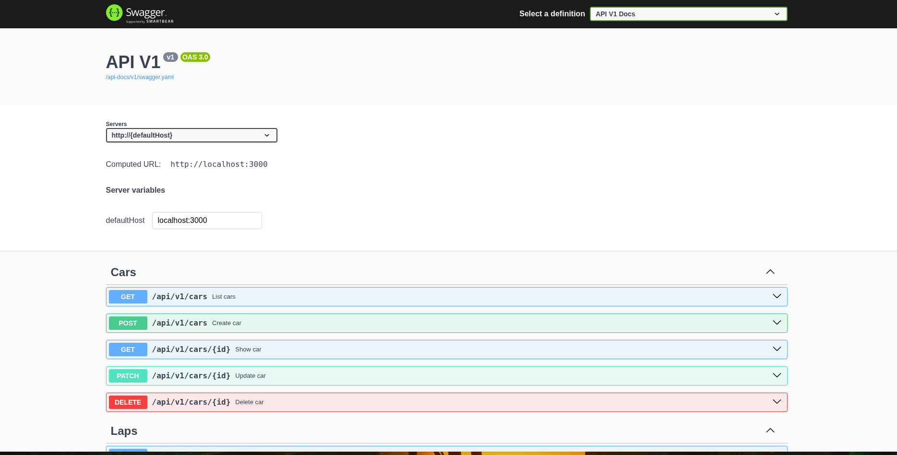

# Car Race Tracking API

A production-ready RESTful API for tracking car races, participants, and lap times. Built with Ruby on Rails 8.1, featuring comprehensive test coverage, automated API documentation, and Docker support.

---

## Table of Contents

- [Features](#-features)
- [Architecture](#-architecture)
- [Quick Start](#-quick-start)
- [API Documentation](#-api-documentation)
- [Database Schema](#-database-schema)
- [API Endpoints](#-api-endpoints)
- [Development](#-development)
- [Testing](#-testing)
- [Deployment](#-deployment)
- [Technology Stack](#-technology-stack)

---

## Features

- **RESTful API** - Full CRUD operations for races, cars, participants, and laps
- **API Versioning** - Future-proof design with `/api/v1` namespace
- **Auto-Generated Documentation** - Interactive Swagger/OpenAPI docs
- **Comprehensive Testing** - 100% line coverage with RSpec
- **Docker Support** - Containerized for easy deployment
- **CI/CD Pipeline** - Automated testing, linting, and security scanning
- **Production-Ready** - Security scanning, error handling, and monitoring
- **High Performance** - Optimized queries with strategic database indexing

---

## Architecture

### Data Model

The application uses a normalized relational database with a join table pattern for many-to-many relationships:

```
┌─────────┐           ┌──────────────────┐           ┌──────┐
│  Races  │───────────│ RaceParticipants │───────────│ Cars │
└─────────┘           └──────────────────┘           └──────┘
                               │
                               │
                               ▼
                          ┌───────┐
                          │  Laps │
                          └───────┘
```

**Key Design Decisions:**

- **RaceParticipant Join Table**: Enables cars to participate in multiple races while maintaining separate lap records for each race
- **Decimal Coordinates**: Uses `DECIMAL(9,6)` instead of floats to avoid precision errors in GPS coordinates
- **Automatic Lap Time Calculation**: Lap times (in milliseconds) are automatically calculated from start and end timestamps
- **Database Constraints**: Foreign keys, unique indexes, and validations ensure data integrity

### Request Flow

```
Controller (app/controllers/api/v1/)
    ↓
Model (app/models/)
    ↓
Database (SQLite)
    ↓
Blueprint Serializer (app/blueprints/)
    ↓
JSON Response
```

---

## Quick Start

### Prerequisites

- **Ruby**: 4.0.0 or higher
- **Rails**: 8.1.2
- **SQLite3**: 2.1 or higher (or Docker)

### Option 1: Docker (Recommended)

```bash
# Clone the repository
git clone https://github.com/yourusername/the_race.git
cd the_race

# copy .env.sample to .env
cp .env.sample .env

# Build the application
docker compose build

# Start the application
docker compose up

# The API is now available at http://localhost:3000

# you can visit http://localhost:3000/api-docs to see the swagger docs.

# access the container shell with:
docker compose exec the_race bash

# inside of shell

# generate swagger docs manually with:
rake rswag:specs:swaggerize

# run tests with:
bundle exec rspec

```

### Option 2: Local Setup

```bash
# Clone the repository
git clone https://github.com/yourusername/the_race.git
cd the_race

# Install dependencies
bundle install

# Setup database
rails db:setup

# Start the server
rails server

# The API is now available at http://localhost:3000

# generate swagger docs manually with:
rake rswag:specs:swaggerize

# run tests with:
bundle exec rspec

```

### Verify Installation

```bash
# Health check
curl http://localhost:3000/up

# Should return: 200 OK

# List races
curl http://localhost:3000/api/v1/races

# Should return: []
```

---

## API Documentation

### Interactive Documentation

Once the server is running, visit:

**http://localhost:3000/api-docs**

This provides an interactive Swagger UI where you can:
- Explore all available endpoints
- View request/response schemas
- Try API calls directly from the browser
- See example payloads



Remember to run `rake rswag:specs:swaggerize` to generate the docs if you make changes to the API.

---

## Database Schema

### Tables

#### races
| Column | Type | Constraints |
|--------|------|-------------|
| id | integer | Primary Key |
| name | string | NOT NULL, UNIQUE |
| track_name | string | NOT NULL |
| start_time | datetime | NOT NULL |
| end_time | datetime | NOT NULL |
| start_latitude | decimal(9,6) | NOT NULL, -90 to 90 |
| start_longitude | decimal(9,6) | NOT NULL, -180 to 180 |
| finish_latitude | decimal(9,6) | NOT NULL, -90 to 90 |
| finish_longitude | decimal(9,6) | NOT NULL, -180 to 180 |
| created_at | datetime | |
| updated_at | datetime | |

**Indexes:** `name` (unique)

#### cars
| Column | Type | Constraints |
|--------|------|-------------|
| id | integer | Primary Key |
| number | integer | NOT NULL |
| team | string | NOT NULL |
| driver_name | string | NOT NULL |
| created_at | datetime | |
| updated_at | datetime | |

**Unique Constraint:** `number` + `team` (same car number can exist in different teams)

#### race_participants
| Column | Type | Constraints |
|--------|------|-------------|
| id | integer | Primary Key |
| race_id | integer | Foreign Key → races, NOT NULL |
| car_id | integer | Foreign Key → cars, NOT NULL |
| created_at | datetime | |
| updated_at | datetime | |

**Unique Constraint:** `race_id` + `car_id` (prevents duplicate participation)

#### laps
| Column | Type | Constraints |
|--------|------|-------------|
| id | integer | Primary Key |
| race_participant_id | integer | Foreign Key → race_participants, NOT NULL |
| lap_number | integer | NOT NULL, > 0 |
| start_time | datetime | NOT NULL |
| end_time | datetime | NOT NULL (must be after start_time) |
| lap_time | integer | NOT NULL (milliseconds, auto-calculated) |
| created_at | datetime | |
| updated_at | datetime | |

**Indexes:** `race_participant_id` + `lap_number` (unique)

### Relationships

```ruby
# Race
has_many :race_participants
has_many :cars, through: :race_participants
has_many :laps, through: :race_participants

# Car
has_many :race_participants
has_many :races, through: :race_participants
has_many :laps, through: :race_participants

# RaceParticipant
belongs_to :race
belongs_to :car
has_many :laps

# Lap
belongs_to :race_participant
has_one :race, through: :race_participant
has_one :car, through: :race_participant
```

---

## 🔌 API Endpoints

### Races

| Method | Endpoint | Description |
|--------|----------|-------------|
| GET | `/api/v1/races` | List all races |
| POST | `/api/v1/races` | Create a new race |
| GET | `/api/v1/races/:id` | Get race details |
| PATCH | `/api/v1/races/:id` | Update a race |
| DELETE | `/api/v1/races/:id` | Delete a race |

### Cars

| Method | Endpoint | Description |
|--------|----------|-------------|
| GET | `/api/v1/cars` | List all cars |
| POST | `/api/v1/cars` | Create a new car |
| GET | `/api/v1/cars/:id` | Get car details |
| PATCH | `/api/v1/cars/:id` | Update a car |
| DELETE | `/api/v1/cars/:id` | Delete a car |

### Race Participants

| Method | Endpoint | Description |
|--------|----------|-------------|
| GET | `/api/v1/race_participants` | List all participants |
| POST | `/api/v1/race_participants` | Add car to race |
| GET | `/api/v1/race_participants/:id` | Get participant details |
| PATCH | `/api/v1/race_participants/:id` | Update participant |
| DELETE | `/api/v1/race_participants/:id` | Remove participant |

### Laps

| Method | Endpoint | Description |
|--------|----------|-------------|
| GET | `/api/v1/race_participants/:id/laps` | List laps for a participant |
| POST | `/api/v1/race_participants/:id/laps` | Record a new lap |
| GET | `/api/v1/laps/:id` | Get lap details |
| PATCH | `/api/v1/laps/:id` | Update a lap |
| DELETE | `/api/v1/laps/:id` | Delete a lap |

### Response Format

**Success Response (200/201):**
```json
{
  "id": 1,
  "name": "Monaco Grand Prix 2026",
  "track_name": "Circuit de Monaco",
  "start_time": "2026-05-24T14:00:00.000Z",
  "end_time": "2026-05-24T16:30:00.000Z",
  "start_latitude": "43.734700",
  "start_longitude": "7.420600",
  "finish_latitude": "43.734700",
  "finish_longitude": "7.420600",
  "created_at": "2026-02-12T04:00:00.000Z",
  "updated_at": "2026-02-12T04:00:00.000Z"
}
```

**Error Response (422):**
```json
{
  "error": {
    "code": "validation_failed",
    "message": "Validation failed",
    "details": {
      "name": ["can't be blank"],
      "start_latitude": ["must be greater than or equal to -90"]
    }
  }
}
```

**Error Response (404):**
```json
{
  "error": {
    "code": "not_found",
    "message": "Resource not found"
  }
}
```

---

### Code Quality

```bash
# Run RuboCop (code style)
bundle exec rubocop

# Auto-fix RuboCop issues
bundle exec rubocop -A

# Security scanning with Brakeman
bundle exec brakeman

# Check for vulnerable dependencies
bundle exec bundler-audit
```

### Console

```bash
# Start Rails console
rails console

# Example: Create a race
> race = Race.create!(
    name: "Test Race",
    track_name: "Test Track",
    start_time: Time.now,
    end_time: 2.hours.from_now,
    start_latitude: 40.7128,
    start_longitude: -74.0060,
    finish_latitude: 40.7128,
    finish_longitude: -74.0060
  )
```

---

## Testing

### Run Tests

```bash
# Run all tests
bundle exec rspec

# Run specific test file
bundle exec rspec spec/requests/api/v1/races_spec.rb

# View coverage report
open coverage/index.html
```

### Test Coverage

Current test coverage: **100%** line coverage

The test suite includes:
- All CRUD operations
- Validation scenarios
- Error handling
- Edge cases
- API documentation generation

---

## 🔧 Technology Stack

### Core Framework
- **Ruby** 4.0.0 - Programming language
- **Rails** 8.1.2 - Web framework (API-only mode)
- **Puma** - Web server
- **SQLite3** - Database (development/test)

### Libraries & Tools

#### API & Serialization
- **Blueprinter** - Fast JSON serialization with clean separation of concerns
- **Rswag** - Auto-generate OpenAPI/Swagger documentation from RSpec tests

#### Testing
- **RSpec Rails** 8.0 - Test framework
- **FactoryBot** - Test data generation
- **SimpleCov** - Code coverage reporting

#### Code Quality & Security
- **RuboCop Rails Omakase** - Code style enforcement (DHH's opinionated style guide)
- **Brakeman** - Static security analysis for Rails
- **Bundler Audit** - Checks for vulnerable gem dependencies

#### Development
- **Debug** - Interactive debugger
- **Docker** - Containerization
- **GitHub Actions** - CI/CD pipeline

### Why These Choices?

| Tool | Alternative | Reason for Choice |
|------|------------|-------------------|
| **Blueprinter** | ActiveModel::Serializers, Jbuilder | Better performance, clearer separation, easier testing |
| **Rswag** | Manual Swagger docs | Docs auto-generated from tests, always in sync |
| **RSpec** | Minitest | More expressive, better tooling, industry standard |
| **FactoryBot** | Fixtures | DRY test data, more flexible |
| **Simplecov** | Coverage | Track code coverage while coding |
| **SQLite** | PostgreSQL (dev) | Zero configuration, fast for development |

---

### Future Optimizations

For production scale, we can consider adding:

1. **Pagination**: Add `pagy` or `kaminari` gem
```ruby
gem 'pagy'
@pagy, @races = pagy(Race.all)
```

2. **Caching**: We can consider adding caching for frequently accessed data

